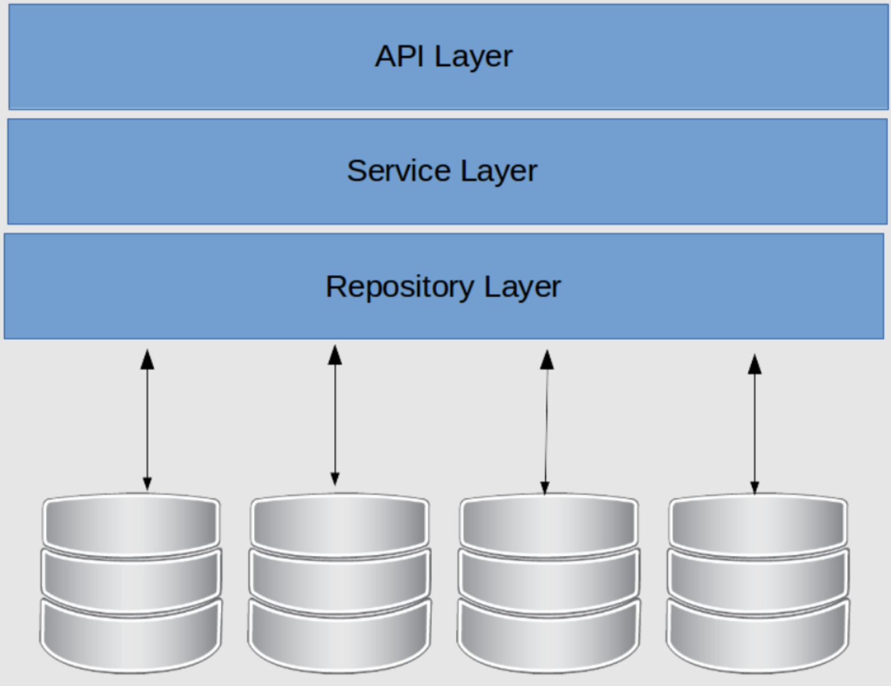

## About this Project

This project is a simple note taking app that allows users to create, read, update, and delete notes. The app uses an golang backend.

## Design Pattern

This project uses a repository pattern. Why use a repository pattern?

1. Flexibility when there is a change in the naming of a table field or a change in the database schema
2. Flexibility when we decide to change ORM, QueryBuilder, or database
3. Ease of finding errors during development

Because I'm separating the business logic and persistence/request logic



1. API Layer (Controller) <br>
   The API layer is a REST API that provides an interface for interacting with applications

2. Service Layer <br>
   The Service layer is responsible for handling the application's business logic.

3. Repository Layer <br>
   The Repository layer is responsible for handling persistence logic. This layer is responsible for sending requests to the database.

## Depedencies

- [Validator](https://github.com/go-playground/validator)
- [MySQL Driver](https://github.com/go-sql-driver/mysql)
- [Golang Dependency Injection](https://github.com/google/wire)
- [Golang Router](https://github.com/julienschmidt/httprouter)
- [Golang Testify](https://github.com/stretchr/testify)
- [Golang Migration](https://github.com/golang-migrate/migrate)

# Tutorial Github

## How to Cloning Repository

1. On your computer open the console/command prompt
2. Enter the Following Command
```
git clone https://github.com/milhamap/simple-note.git
```
3. Enter the Clone Results Folder
```
cd simple-note
```

## How to Use Application

1. Install Golang Terlebih Dahulu <br>
   [Download disini](https://go.dev/doc/install)
2. Install all golang dependecies Terlebih Dahulu
```
$ go get
```
3. Create a new database in phpmyadmin with the name  `simple_note` for application database and `simple_note_test` for testing database
4. Migration database using `golang migrate` for application database
```
$ migrate -database "mysql://root@tcp(localhost:3306)/simple_note" -path db/migrations up
```
5. Migration database using `golang migrate` for testing database
```
$ migrate -database "mysql://root@tcp(localhost:3306)/simple_note_test" -path db/migrations up
```

## How to Run

1. Open the terminal/command prompt
2. Enter the Following Command
```
$ go run main.go
```

## API Documentation

You can access this project API documentation at test.http